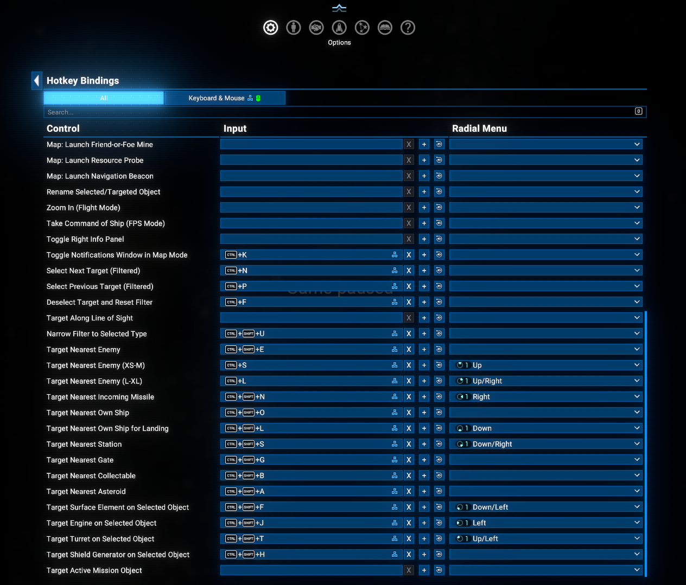
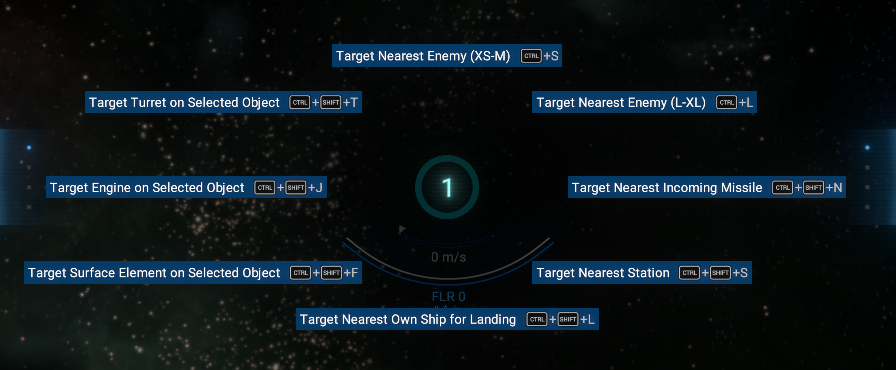

# Hotkey Names on Radial Menu

An add-on for the `Native Hotkey API` that makes hotkeys registered through it show their real names on the radial (compass) menu, instead of the internal `(Debug)A` style placeholders.

## Overview

X4's `INPUT_ACTION_*` list is compiled into the game and cannot be extended, so the *Native Hotkey API* hands out otherwise-unused debug action slots to the mods that register with it. Every part of the game that names a control by looking it up in the game's own text database therefore shows those slots under their built-in placeholder names - `(Debug)A`, `(Debug)F12` and so on.

The radial menu is the one place where this is visible in normal play. Assign a mod hotkey to a radial menu position and the wheel labels it `(Debug)A`, with no clue which action it actually triggers.

This mod fixes that radial menu label issue. The wheel is drawn by `ui/core/lua/compass.lua`, which runs in the game's isolated core UI environment - it can reach neither the *Native Hotkey API*'s registry nor any other mod's Lua. This add-on substitutes that file and gives it a channel to ask, so each radial position shows the name the registering mod actually chose.

Since this mod requires replacing the core UI file, it is distributed as a separate extension and is most beneficial for players who actively use the radial menu in-game—particularly controller users.

There is nothing to configure. Install it and the radial menu starts using real names.

## Requirements

- **X4: Foundations**: Version **8.00** or higher (the 8.00.xx build of this mod) or **9.00** or higher (the 9.00.xx build).
- **Native Hotkey API**: Version **8.00.09** or higher by [Chem O`Dun](https://www.nexusmods.com/profile/chemodun?gameId=2659).
  - Available on Steam Workshop: [Native Hotkey API](https://steamcommunity.com/sharedfiles/filedetails/?id=3750545906)
  - Available on Nexus Mods: [Native Hotkey API](https://www.nexusmods.com/x4foundations/mods/2181)
- **Print Extension List**: Version **1.01** or higher by [Chem O`Dun](https://www.nexusmods.com/profile/chemodun?gameId=2659).
  - Available on Nexus Mods: [Print Extension List](https://www.nexusmods.com/x4foundations/mods/2172)

## Installation

- **Steam Workshop**: [Hotkey Names on Radial Menu](https://steamcommunity.com/sharedfiles/filedetails/?id=3780453833) - only for game versions 9.00 and higher.
- **Nexus Mods**: [Hotkey Names on Radial Menu](https://www.nexusmods.com/x4foundations/mods/2308) - select the appropriate file based on version of your game build (8.00 or 9.00).

## How to use it

- Register a hotkey as usual - any mod built on the *Native Hotkey API* already does this for you.
- Open **Options > Hotkey Management**, find the hotkey, and use the radial menu drop-down at the end of its row to assign it to a position on one of the two wheels.
  
- Open that wheel in flight. The position now carries the hotkey's own name.
  

Names are re-read whenever the set of registered hotkeys changes, so installing, removing or disabling a hotkey mod is reflected the next time the wheel is opened.

## Limitations

- This mod replaces the whole of `ui/core/lua/compass.lua`, because the game offers no way to extend a core UI script. **It is incompatible with any other mod that replaces the same file.**
- Separate builds are required for each major game version.
- Only the radial menu is affected. Anywhere else the game names these slots from its own text database still shows the built-in placeholder.

## Credits

- **Author**: Chem O`Dun, on [Nexus Mods](https://www.nexusmods.com/profile/ChemODun/mods?gameId=2659) and [Steam Workshop](https://steamcommunity.com/id/chemodun/myworkshopfiles/?appid=392160)
- *"X4: Foundations"* is a trademark of [Egosoft](https://www.egosoft.com).

## Acknowledgements

- [EGOSOFT](https://www.egosoft.com) - for the X series.
- **Nistur** and an unknown Egosoft UI developer on Egosoft's [Discord](https://discord.gg/ThBjrERNX) for guiding me in the right direction to transfer the data to the core UI environment.

## Changelog

### [9.00.01] / [8.00.01] - 2026-08-09

- **Added**
  - Initial release.
